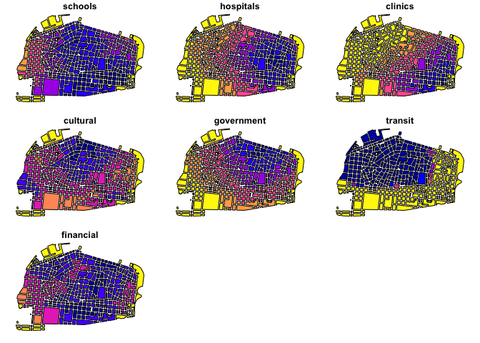
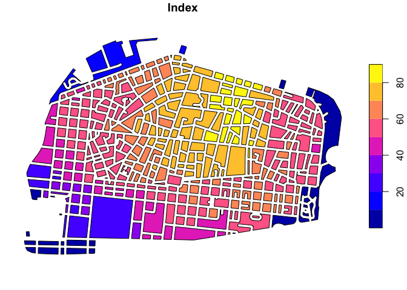

Spatial prioritization
================

## Introduction

This package was developed to assist in spatial and non-spatial
prioritization. We have used these tools to support spatial planning or
for investment prioritization.

## Installation

You can install the package via devtools. Once that it is installed,
just call the package.

``` r
# install.packages(devtools); library(devtools)
# install_github("ricardoochoa/prioritization")
library(prioritization)
library(sf)
```

## Data

You can load your own spatial or tabular data, but in this example we
will use one of the package data frames for Male, Maldives. The
*male_spatial* data frame contains isochrones and isodistances for Male,
Maldives for selected urban services. With the following lines we will
load and plot all spatial layers in the data frame.

``` r
data("male_spatial")
plot(male_spatial)
```

<!-- -->

As can be seen from the figure, the data frame contains isochrones (in
minutes) to schools, hospitals, clinics, cultural (centers), government
(offices), and financial services (ATMs and banks); and isodistances (in
meters) to public transit stations.

Next, we will import the configuration (config) file for Male.

``` r
data("male_config")
male_config
```

| id         | name                                | weight | direction         | method  | min | max |
|:-----------|:------------------------------------|-------:|:------------------|:--------|----:|----:|
| schools    | Time to nearest school              |    1.0 | smaller is better | observe |   5 |  30 |
| hospitals  | Time to nearest hospital            |    0.5 | smaller is better | observe |   5 |  30 |
| clinics    | Time to nearest clinic              |    0.5 | smaller is better | observe |   5 |  30 |
| cultural   | Time to nearest cultural center     |    1.0 | smaller is better | observe |   5 |  35 |
| government | Time to nearest government building |    1.0 | smaller is better | observe |   5 |  30 |
| transit    | Time to nearest bus stop            |    1.0 | smaller is better | observe |   0 | 100 |
| financial  | Time to nearest ATM or bank         |    1.0 | smaller is better | observe |   5 |  35 |

As can be seen from the table, the data frame contains basic information
for each layer (*id* and *name*) in the first two variables (columns).

The *weight* column describes how relevant is a layer as compared to
others. The *prioritization* function will compute the weighted mean to
aggregate all layers in a single index. Please note that in the
*male_config* table all layers have equal weights, except for
*hospitals* and *clinics*. In this example, we will consider that both
layers are part of the same category: “health facilities”, and
therefore, together, they have the same weight as other categories such
as “education facilities” (schools) or “mobility” (transit).

The *direction* variable describes whether the index should increase (or
decrease) with higher (or lower) values in a layer. For example, if a
user is mapping locations for a housing project, which minimize
commuting time, it will be natural to expect that shorter distances to
schools are better than longer distances. In this example, smaller
numbers are better, or in therms of the tool the *direction* is “smaller
better”.

The *method* variable describes how data in different units is
transformed into a dimensionless index with values in the range 0 to
100. Options include: *benchmark* and *observe*.

The *benchmark* method standardizes data according to the definition of
minimum and maximum references Such standards are described in the *min*
and *max* variables in the table. Users can modify such columns
according to their specific needs. Values below the *min* benchmark are
treated as zeros and values above the *max* benchmark are treated as
100. All the rest are normalized linearly in a scale from 0 to 100.

The *observe* method standardizes data according to the minimum and
maximum observed values. The minimum observed value in the data frame is
treated as zero, the maximum is treated as 100. Again, all the rest are
standardized linearly. If the observe method is selected, *variables*
min and *max* will be ignored.

## Spatial prioritization

Now, we will integrate a single index from all variables in the
*male_spatial* data frame, using the **observe** method.

``` r
male <- prioritization(x = male_spatial, config = male_config)
plot(male["Index"])
```

<!-- -->

The map highlights, in yellow, areas that have overall better
accessibility to urban services. That’s it. In just 10 lines of code you
have developed a spatial prioritization exercise for Male.
